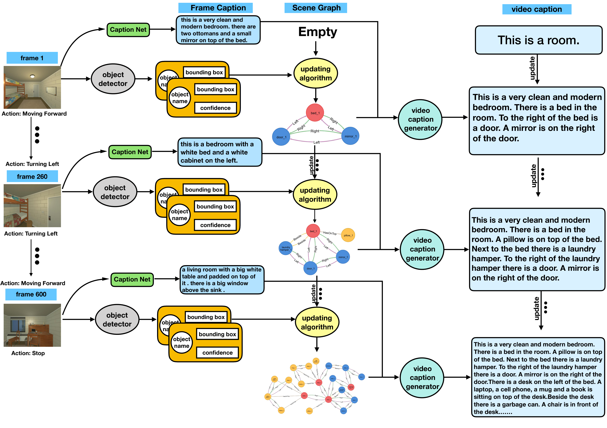

Robots are usually equipped with cameras to explore the indoor scene and it is expected that the robot can well describe the scene with natural language. Although some great success has been achieved in image and video captioning technology, especially on many public datasets, the caption generated from indoor scene video is still not informative and coherent enough. In this paper, we propose the problem of \textit{Indoor Scene Captioning from Streaming Video}, which aims at generating a more accurate and informative caption from streaming video. To solve this problem, we firstly design an algorithm to organize the visual information of the indoor scene into a scene graph, and then implement a scene graph guided captioning method, which takes the scene graph and video frames as input is implemented to generate the caption from the video streaming. The proposed framework is evaluated both on the AI2THOR dataset and a real-word robotic platform, demonstrating the effectiveness of the framework.

The exihibiting videos would be uploaded soon

<video id="video" controls="controls" preload="none" poster='FP5_p4.png'>
      <source id="mp4" src="FP5_p4.mp4" type="video/mp4">
      
Your user agent does not support the HTML5 Video element.

</video>

<video id="video" controls="controls" preload="none" width="1440" height="760" poster='FP206_p4.png'>
      <source id="mp4" src="FP206_p4.mp4" type="video/mp4">
      
Your user agent does not support the HTML5 Video element.

</video>

<video id="video" controls="controls" preload="none" width="720" height="380" poster='office_b1_p5.png'>
      <source id="mp4" src="office_b1_p5.mp4" type="video/mp4">
      
Your user agent does not support the HTML5 Video element.

</video>

<video id="video" controls="controls" preload="none" width="1440" height="760" poster='s1_b2_p4.png'>
      <source id="mp4" src="s1_b2_p4.mp4" type="video/mp4">
      
Your user agent does not support the HTML5 Video element.

</video>

peac

